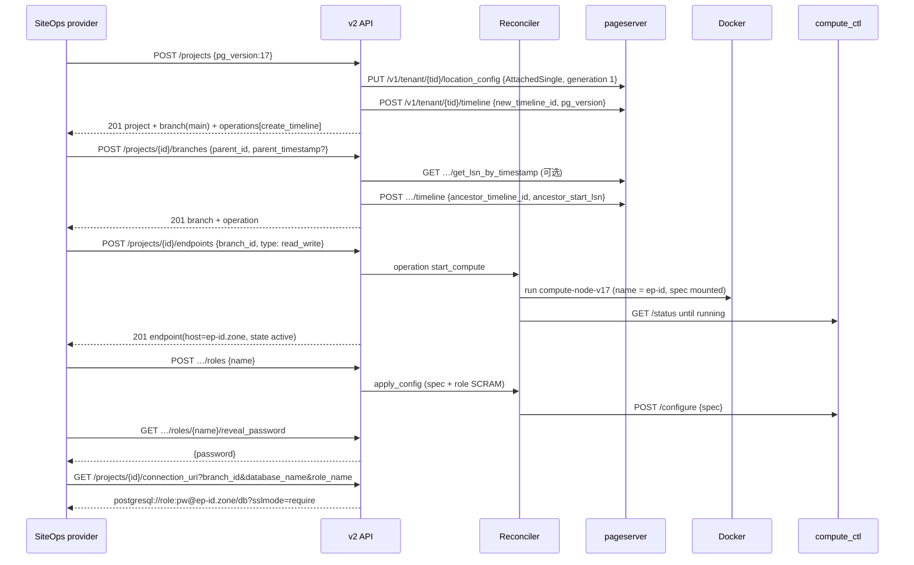

# 001 Neon API v2 兼容控制面：设计与卡点分析

> **历史文档**：本文是 2026-09-07 的设计记录，按当时的第一消费方（另一个平台项目）写的，保留原文不改写。仓库现在是独立的 `neon-control-plane`：目的只有一个——补上 Neon 开源数据面缺失的管理 API。当前形态以 README 为准。
>
> **文档版本**：v1.0  
> **日期**：2026-09-07  
> **仓库**：`neon-control-plane`  
> **一句话**：用一个自研控制面实现 Neon 云端管理 API（`console.neon.tech/api/v2`）的子集，后端接 Neon 开源自部署组件（pageserver / safekeeper / storage_broker / compute-node / proxy）。  
> **事实来源标注**：`[F]` 官方仓库/文档/镜像上查到的事实（来源见文末）；`[C]` 当时消费方的代码事实；`[D]` 本文决定；`[?]` 尚需在 M0 实测核对。

## 0. 结论先行

- **可行**。Neon 开源了全部数据面组件并发布 arm64/amd64 镜像；控制面（v2 API、Console、autoscaler）不开源，但控制面要做的事——建租户/时间线、生成 compute spec、起停 compute、发口令、发连接串、轮询操作——每一步都有开源组件的接口可调。搜过的替代品（NeonD、neon-operator、Neon Local）都不兼容 v2，所以只能自己写。
- **规模**：SiteOps 只用 v2 的 15 条路径；本文把子集定在 20 条（补齐 project 创建/删除、endpoint start/suspend、branch set_as_default）。控制面本体估计 6–8 千行 TypeScript，含契约测试；一人 4–6 周到 M3（可被 SiteOps 完整使用）。
- **卡点 13 项，无一是死结**：2 项硬卡点（proxy 的控制面内部 API、compute spec 都没有兼容承诺，靠钉版本 + 契约测试压住），1 项架构差异（scale-to-zero 靠容器起停 + proxy 唤醒模拟，不做 NeonVM 自动伸缩），其余是工程量。详见第 8 节。
- **对 SiteOps 的价值**：本地栈里 Neon 这一格从"部分替身"变成"同构"（106 文档 §2.2），SaaS-011.5 两租户隔离实证、014 的 Directus/站点数据面都能在本机跑真流程。

## 1. 目标与非目标

**目标**
1. 请求/响应与官方 OpenAPI（`spec/neon-api-v2.json`，OpenAPI 3.0.3，120 条路径 `[F]`）逐字段一致；契约测试用官方 schema 校验每个响应。
2. 覆盖子集见 `spec/SUBSET.md`：projects、branches、endpoints、databases、roles（含 `reset_password`/`reveal_password`）、`connection_uri`、operations，共 20 条路径。
3. 消费者验收：(a) SiteOps `packages/provider-neon` 的真实客户端对着它跑通 `database.create/preview/observe/health/delete`、`site_role.converge/delete`；(b) 官方 `neonctl --api-host` 与 `neon-api-python` 能列项目、建分支。
4. 单机 Docker Compose 部署，Apple Silicon 与 x86 都能跑。

**非目标（明确不做）**
- Neon Auth、Data API、AI Gateway、Buckets、Functions、Logs、Snapshots、Organizations/VPC、Consumption 精确计量（v2 其余 100 条路径）。
- 自动伸缩（NeonVM / autoscaler-agent）、多区域、HA 与多 pageserver 分片调度（交给 M4 或 neon-operator）。
- 与 Neon 官方"兼容认证"——这是自用控制面，不冒充官方服务。

## 2. 概念映射：v2 对象 ↔ 开源组件

| v2 对象 / 字段 | 开源落点 `[F]` | 本方案做法 `[D]` |
|---|---|---|
| Project（`id`、`pg_version`、`region_id`、`default_branch_id`） | pageserver **tenant**（`tenant_id` 16 字节 hex） | 一个 project = 一个 tenant；`id` 用 Neon 风格 slug（`adj-noun-123456`，匹配 SiteOps 的 `projectPattern /^[a-z0-9-]{1,60}$/` `[C]`）；`region_id` 固定 `local`；`pg_version` 决定 compute 镜像 |
| Branch（`id`、`parent_id`、`parent_lsn`、`parent_timestamp`、`default`、`protected`、`current_state`、`logical_size`） | pageserver **timeline**：`POST /v1/tenant/{tid}/timeline`（`new_timeline_id`、`ancestor_timeline_id`、`ancestor_start_lsn`、`pg_version`）；`GET …/timeline/{tlid}`（`last_record_lsn`、逻辑大小）；`get_lsn_by_timestamp` | `id` 形如 `br-adj-noun-a1b2c3d4`；`parent_timestamp` → 先 `get_lsn_by_timestamp` 再建；`protected`/`default` 只是控制面标记 |
| Endpoint（`id`、`type read_write/read_only`、`host`、`current_state init/active/idle`、`suspend_timeout_seconds`、`autoscaling_limit_*`） | **compute-node 容器**（`compute_ctl` + Postgres），spec 的 `mode` = `Primary` / `Replica` / `Static` | 一个 endpoint = 一个容器，容器名 = endpoint id（Docker DNS 直接可解析）；`host` = `<endpoint_id>.<zone>`；`idle` = 容器已停；autoscaling 字段只存不生效（可映射到容器 CPU/内存配额） |
| Role（`name`、`protected`、口令） | spec `cluster.roles[]`：`name`、`encrypted_password`（SCRAM 验证器）、`options`；改动经 `POST /configure` 或 `delta_operations`（`action`、`name`、`new_name`） | 控制面生成明文口令，主密钥加密存储供 `reveal_password`；同时算 SCRAM-SHA-256 验证器写进 spec 与 proxy 的 `role_secret` |
| Database（`name`、`owner_name`） | spec `cluster.databases[]`：`name`、`owner`、`options`；删除走 `delta_operations` | 同上，改 spec 后 `/configure` |
| Operation（`id`、`action`、`status`、`branch_id`、`endpoint_id`、`total_duration_ms`） | 无对应（云端控制面私有） | 控制面自己的状态机表；`action` 取值沿用 v2 词汇（`create_timeline`、`start_compute`、`apply_config`、`suspend_compute`、`delete_timeline`、`delete_tenant`…） |
| `connection_uri` | proxy（SNI 路由 + 控制面鉴权）或 `pg_sni_router`（纯 SNI 路由） | M1 直连端口；M2 `pg_sni_router`；M3 完整 proxy，见第 3.3 节 |
| PITR / 按时间建分支 | `get_lsn_by_timestamp`、tenant 配置 `pitr_interval` | 默认 `pitr_interval = 7d`（对齐 Neon 免费档） |
| Region / Org / API key | 无 | 单 region `local`、单 org；API key 表 |

## 3. 架构

### 3.1 组件（单机 Docker Compose）

```mermaid
flowchart LR
  subgraph clients[客户端]
    P[SiteOps neon-provider-service]
    N[neonctl / neon-api-python]
    A[应用 / Directus]
  end
  subgraph cp[控制面容器 neon-control-plane]
    API[v2 API<br/>Hono + zod<br/>:8080/api/v2]
    CPL[proxy 控制面内部 API<br/>/cplane/get_endpoint_access_control<br/>/cplane/wake_compute]
    REC[Reconciler<br/>操作状态机 + Docker 起停]
    DB[(SQLite WAL<br/>projects/branches/endpoints<br/>roles/databases/operations)]
  end
  subgraph storage[Neon 存储层 镜像 neondatabase/neon]
    SB[storage_broker :50051]
    PS[pageserver :9898 HTTP / :6400 PG]
    SK[safekeeper x1→x3 :7676 / :5454]
    MIO[(MinIO 远端存储)]
  end
  subgraph compute[计算层 每 endpoint 一个容器]
    C1[compute-node-v17<br/>compute_ctl :3080 + Postgres :55433]
    C2[compute-node-v17 …]
  end
  PRX[proxy / pg_sni_router<br/>TLS + SNI :5432]
  P & N --> API
  API --> DB
  API --> REC
  REC -->|/v1/tenant, /v1/tenant/{t}/timeline| PS
  REC -->|docker run / stop| C1 & C2
  REC -->|/configure /status /terminate| C1
  PS <--> SB
  SK <--> SB
  C1 -->|basebackup / WAL| PS & SK
  PS & SK --> MIO
  A -->|postgresql://…@ep-xxx.zone| PRX
  PRX -->|get_endpoint_access_control / wake_compute| CPL
  CPL --> REC
  PRX --> C1
```

- **控制面**：TypeScript（Node 22，Hono，zod 从 OpenAPI 生成的 schema 做请求校验），单进程，SQLite（WAL）存状态；用 Docker Engine API（挂载 `/var/run/docker.sock`）起停 compute 容器。选 TypeScript 是为了复用 SiteOps 团队的技术栈与测试习惯，不是技术上的必然。
- **存储层**：官方 `docker-compose/docker-compose.yml` 的形状 `[F]`——`storage_broker --listen-addr=0.0.0.0:50051`、`pageserver`（HTTP 9898，远端存储指向 MinIO）、`safekeeper`（HTTP 7676，PG 5454，WAL 备份到 MinIO）。M1 一台 safekeeper，M3 三台。不用 `storage_controller`：官方 compose 也不用，直接 `PUT /v1/tenant/{tid}/location_config`（`mode: AttachedSingle`、`generation: 1`）`[F]`；多 pageserver 时再引入（它自身要一个 Postgres 存 generation `[F]`）。
- **计算层**：镜像 `neondatabase/compute-node-v14…v17`（按 project 的 `pg_version` 选），启动命令沿用官方 compose 的 `compute_ctl --pgdata /var/db/postgres/compute -C "postgresql://cloud_admin@localhost:55433/postgres" -b /usr/local/bin/postgres --compute-id … --config <spec> --dev` `[F]`；spec 由控制面生成，通过挂载文件或 `/configure` 下发。
- **入口**：`proxy` 与 `pg_sni_router` 都在 `neondatabase/neon` 镜像里 `[F]`（Dockerfile COPY 了 `proxy`、`pg_sni_router`、`pageserver`、`safekeeper`、`storage_broker`、`storage_controller`、`neon_local` 等）。
- **镜像**：Docker Hub `neondatabase/neon`、`compute-node-v16/v17` 均为 `amd64/linux + arm64/linux`，最新 tag 2025-09-02 `[F]`——Apple Silicon 原生可跑。

### 3.2 一次典型流程



### 3.3 连接路由的三档

Postgres 协议在 TLS 之前先发 `SSLRequest`，通用 L4 SNI 路由器（HAProxy/Caddy L4）不能直接路由，必须用懂 Postgres 握手的组件；这是 Neon 自带 proxy 存在的原因。

| 档 | 组件 | 连接串 | 鉴权 | 唤醒空闲 compute | 何时用 |
|---|---|---|---|---|---|
| A 直连端口 | 无 | `postgresql://role:pw@127.0.0.1:<port>/db` | Postgres 自己（SCRAM） | 否 | M1；SiteOps 本地栈够用 |
| B `pg_sni_router` | 镜像自带 `pg_sni_router`：TLS 终结 + 把 SNI `svc--ns--port.zone` 解析成 `svc.ns.dest:port` `[F]` | `postgresql://role:pw@<ep>--<ns>--55433.db.zone/db?sslmode=require` | Postgres 自己 | 否 | M2；主机名形状对齐，零控制面耦合 |
| C `proxy --auth-backend control-plane` | 官方 proxy：SNI 首个标签 = endpoint id；调控制面 `get_endpoint_access_control`（返回 `role_secret` SCRAM 密钥、`allowed_ips`、`project_id`…）与 `wake_compute`（返回 `address host:port`、`aux{endpoint_id,project_id,branch_id,compute_id}`）；请求带 `Authorization: Bearer <NEON_PROXY_TO_CONTROLPLANE_TOKEN>`、query `endpointish`、`role`、`session_id` `[F]` | `postgresql://role:pw@ep-xxx.db.zone/db?sslmode=require`（与云端完全同形） | 控制面 | 是 | M3；scale-to-zero 与 IP 白名单都靠它 |

C 档的 TLS 证书：本地用 Caddy 的本地 CA 签一张 `*.db.siteops.localhost` 通配证书（`~/Library/Application Support/Caddy/pki/authorities/local/`，SiteOps 本地栈已信任该 CA），线上用真实证书。

## 4. API 合同

- 基路径 `/api/v2`；鉴权 `Authorization: Bearer <api_key>`；错误体沿用 spec 的 `GeneralError`（`code`、`message`）。
- 每条路径的请求体、响应体、状态码以 `spec/neon-api-v2.json` 为准；控制面启动时把子集的 schema 编译成校验器，测试里对每个响应做 `ajv` 校验，任何字段缺失都算失败。
- Operations 语义：所有会触发存储/计算变更的调用返回 `operations[]`；`GET /projects/{id}/operations/{op}` 轮询；状态 `scheduling → running → finished | failed`，`retry_at`/`error` 字段对齐 spec。SiteOps provider 会轮询它 `[C]`。
- ID 形状：project `adj-noun-123456`；branch `br-…`；endpoint `ep-…`；role/database 名保持用户输入（校验对齐 spec 的 `PgIdent`）。SiteOps 侧的校验正则 `[C]`：project `/^[a-z0-9-]{1,60}$/`、branch `/^[A-Za-z0-9][A-Za-z0-9._:-]{0,127}$/`、name `/^[A-Za-z0-9][A-Za-z0-9._-]{0,62}$/`——生成的 id 全部落在其中。
- 扩展点（v2 没有，用响应头/额外字段不破坏 schema）：`X-Neon-CP-Mode: direct|sni-router|proxy` 标明连接路由档；`GET /healthz` 与 `/readyz`。

## 5. 数据模型（SQLite）

| 表 | 关键列 | 说明 |
|---|---|---|
| `projects` | `id`, `tenant_id`, `name`, `pg_version`, `region_id`, `default_branch_id`, `settings_json`, `created_at`, `updated_at`, `deleted_at` | `tenant_id` 唯一 |
| `branches` | `id`, `project_id`, `timeline_id`, `name`, `parent_id`, `parent_lsn`, `parent_timestamp`, `is_default`, `protected`, `state`, `logical_size_cache`, `created_at` | `state`：`init/ready/deleting` |
| `endpoints` | `id`, `project_id`, `branch_id`, `type`, `state`, `container_id`, `host`, `pg_port`, `http_port`, `suspend_timeout_seconds`, `autoscaling_json`, `settings_json`, `last_active_at` | `type`：`read_write`（Primary）/`read_only`（Replica） |
| `roles` | `id`, `branch_id`, `name`, `password_ciphertext`, `scram_secret`, `protected`, `created_at` | 主密钥 AES-256-GCM；`scram_secret` = `SCRAM-SHA-256$4096:<salt>$<StoredKey>:<ServerKey>` |
| `databases` | `id`, `branch_id`, `name`, `owner_name`, `created_at` | |
| `operations` | `id`, `project_id`, `branch_id`, `endpoint_id`, `action`, `status`, `error`, `retry_at`, `created_at`, `updated_at`, `total_duration_ms`, `steps_json` | 每步幂等，重启后由 Reconciler 续跑 |
| `api_keys` | `id`, `name`, `key_hash`, `created_at`, `last_used_at` | |
| `settings` | `key`, `value` | zone、镜像 tag、路由档等运行时配置 |

## 6. 关键实现细节

1. **Compute spec 生成**：沿用官方 compose 的模板结构（`compute_wrapper/var/db/postgres/configs/`）`[F]`；必填 `tenant_id`、`timeline_id`、`mode`、`safekeeper_connstrings`、`pageserver_connstring`（新字段 `pageserver_connection_info` 存在，旧字段仍可用 `[F]`）、`cluster.roles`（必须含 `cloud_admin` 超级用户，compute_ctl 用它连本机 Postgres）、`cluster.databases`、`cluster.settings`；`skip_pg_catalog_updates=false`；`endpoint_id`/`project_id` 字段 `[F]` 顺手填上，便于日志。
2. **起 compute**：`docker run` 指定网络别名 = endpoint id、挂载 spec、暴露 55433（PG）与 3080（HTTP）；轮询 `GET /status` 直到 `running`（状态枚举 `empty/configuration_pending/init/running/configuration/failed/terminated…` `[F]`）。
3. **改角色/库**：更新 spec → `POST /configure {spec}`；删除与重命名用 `delta_operations[{action,name,new_name}]` `[F]`；`reset_password` = 新口令 + 新 SCRAM + `/configure`。
4. **SCRAM 验证器**：Node `crypto.pbkdf2`（SHA-256，4096 轮）+ HMAC 求 StoredKey/ServerKey，输出 Postgres 格式；同一份既写 spec `encrypted_password`，也回给 proxy 的 `role_secret`。
5. **建分支**：`ancestor_start_lsn` 缺省取父时间线 `last_record_lsn`；`parent_timestamp` 先查 `get_lsn_by_timestamp`；超出 `pitr_interval` 返回 spec 里的 `WrongLsnOrTimestamp` 类错误。
6. **删除级联**：endpoint → 容器 `POST /terminate` 后 `docker rm`；branch → 先停其 endpoints 再 `DELETE …/timeline/{tlid}`；project → 先所有 timeline 再 `DELETE /v1/tenant/{tid}`；每一步是一个 operation step。
7. **空闲挂起**：`suspend_timeout_seconds > 0` 时，Reconciler 按 compute `GET /metrics.json` 的最后活动时间判定空闲，`/terminate` 并停容器，状态 `idle`；`wake_compute` 或 `POST …/endpoints/{ep}/start` 重新起容器（基础备份从 pageserver 拉，秒级）。
8. **持久化**：pageserver 与 safekeeper 的远端存储指向 MinIO（compose 里已有 `[F]`）；compute 的 pgdata 是可丢弃的（每次启动重新 basebackup）；控制面 SQLite 与 MinIO 数据卷是唯一需要备份的状态。
9. **版本钉住**：存储镜像与 compute 镜像使用同一次 CI 构建的同名 tag（Docker Hub 上 `neon` 与 `compute-node-v17` 有相同的数字 tag `[F]`，如 `8464`），`[?]` M0 实测该组合互通；官方 release 分 `release-XXXX`（存储）/`release-compute-XXXX`/`release-proxy-XXXX` 三条线 `[F]`，升级时三者一起换并重跑契约与端到端测试。

## 7. 与 SiteOps 的接线 `[D]`

| 项 | 做法 |
|---|---|
| provider 指向 | `apps/neon-provider-service` 顶层 `NEON_API_BASE_URL=https://neon-api.siteops.localhost:8443/api/v2`（Caddy 新增站点块 → 控制面 8080）；`env.development`/`env.production` 保持云端 |
| API key | 走现有 `NEON_CREDENTIAL_HANDLE`（`neon_local_management_v1`）→ secret-backend-service 的本地密钥，开发者把控制面发的 key 放进 `.dev.vars` |
| 连接串 | M1 直连端口；M2 起走 `*.db.siteops.localhost:5432`（proxy/pg_sni_router 用 Caddy CA 签的通配证书） |
| Directus 数据面 | `infra/local/compose.yaml` 的 Directus 改用控制面发的 branch 连接串，验证 114/115 的 Workspace-per-Project 与分支模型 |
| 验收 | SaaS-011.5 两租户隔离实证在本机跑：两个 project → 各自 tenant → 各自 role/database → 交叉访问被拒 |
| 106 文档 | Neon 一行从"部分替身"改为"同构（自研控制面 + 开源数据面）" |

## 8. 卡点分析

| # | 卡点 | 等级 | 事实与影响 | 对策 |
|---|---|---|---|---|
| 1 | proxy ↔ 控制面内部 API 无文档、无兼容承诺 | **高→中** | 路径、参数、响应字段只能从 `proxy/src/control_plane/client/cplane_proxy_v1.rs` 与 `messages.rs` 抠 `[F]`；`release-proxy-*` 单独发版，字段可能变 | 钉 proxy 版本；把抠出的合同写成契约测试；M1/M2 不依赖它（直连/`pg_sni_router`），M3 才接 |
| 2 | ComputeSpec 与 compute_ctl HTTP API 是内部接口 | **中** | spec 里同时存在新旧字段（`pageserver_connection_info` / `pageserver_connstring`）`[F]`；跨版本可能改名；`delta_operations` 语义只有源码 | 存储与 compute 钉同一 tag；每次升级跑 M0 冒烟（起 compute、建库、改口令）；spec 生成集中在一个模块 |
| 3 | pageserver `/v1/` 同为内部 API；不用 storage_controller 时要自管 `generation` | **中** | 官方 compose 也是直接 `location_config` + `generation: 1` `[F]`，单 pageserver 可行；多 pageserver 必须上 storage_controller（要 Postgres） | M1–M3 单 pageserver；M4 再上 storage_controller |
| 4 | scale-to-zero / 自动伸缩 | **中（架构差异）** | 云端是 NeonVM + autoscaler-agent（k8s），Docker 上没有 | 容器起停 + 空闲计时 + proxy `wake_compute` 模拟；`autoscaling_limit_*` 只存不生效；冷启动 = basebackup 时间（秒级） |
| 5 | Postgres SNI 路由 | **中** | 通用 L4 SNI 路由不认 `SSLRequest`；必须 proxy / `pg_sni_router`，或 PG17 客户端 `sslnegotiation=direct` | 三档路由（§3.3）；本地开发 A 档即可 |
| 6 | 角色/库的删除与改名 | **低-中** | 走 `delta_operations`；compute_ctl 对"spec 里消失的角色"是否自动 DROP 需实测 `[?]` | M0 用例覆盖：删角色后其拥有对象的归属 |
| 7 | 口令可逆存储（`reveal_password`） | **低** | v2 语义就是可取回明文；云端也如此 | 主密钥 AES-GCM，密钥只在环境变量；SCRAM 验证器另存 |
| 8 | 多个 Postgres 大版本 | **低** | 每版一个 compute 镜像（v14–v17）`[F]` | 按 `pg_version` 选镜像；默认 17 |
| 9 | 鉴权/多租户模型简化 | **低** | 无 org/RBAC/IP 白名单（A/B 档） | 单 org、API key；C 档用 proxy 的 `allowed_ips` |
| 10 | Docker socket 权限 | **低** | 控制面要起停容器 | 本机 compose 挂 socket；服务器用 rootless Docker 或 k8s（届时对齐 neon-operator 的 CRD） |
| 11 | 镜像 tag 与三条 release 线的对应关系 | **低（待核）** | Docker Hub 只有数字 tag，GitHub 有 `release-*` 三种 `[F]`，映射未见文档 | M0 用 `latest` 同批 tag 验证互通后钉住 |
| 12 | 许可与命名 | **低** | Neon 源码 Apache-2.0 `[F]`；"Neon" 是商标 | 仓库名不含 `neon` 官方暗示（暂名待定），README 写明非官方 |
| 13 | 与 `neonctl` 的兼容性验收 | **低** | `neonctl` 支持自定义 API host `[?]`（`NEON_API_HOST`/`--api-host` 需核对） | 作为 M1 验收项之一，不作为阻塞 |

已确认**不是**卡点：Apple Silicon（arm64 镜像齐全 `[F]`）；PITR 与按时间建分支（pageserver 有 `get_lsn_by_timestamp` `[F]`）；只读副本（spec `mode: Replica` `[F]`）；对象存储（MinIO 已在官方 compose）。

## 9. 里程碑与验收

| 里程碑 | 内容 | 验收 |
|---|---|---|
| M0（1 周） | 仓库骨架；compose 起 storage_broker + pageserver + safekeeper + MinIO；用官方 `compute.sh` 的等价脚本起一个 compute；v2 `/projects` CRUD（无 compute）；契约测试框架 | `psql` 连上 compute；`/projects` 响应通过官方 schema 校验；镜像 tag 互通 |
| M1（1.5 周） | branches、endpoints、roles、databases、operations、`connection_uri`（直连端口）；Reconciler；SCRAM | SiteOps `provider-neon` 客户端 7 个操作全通；`neonctl projects list / branches create` 通 |
| M2（1 周） | `pg_sni_router` + 通配证书；主机名连接串；Caddy 接线；106 文档改口 | Directus（compose）用控制面发的连接串启动 |
| M3（1.5 周） | 官方 proxy `control-plane` 后端：`get_endpoint_access_control`、`wake_compute`；挂起/唤醒；PITR 分支；逻辑大小 | 空闲 → `idle` → 连接自动唤醒；SaaS-011.5 两租户隔离在本机跑通 |
| M4（可选） | 3 safekeeper、storage_controller、多 pageserver、k8s | 与 neon-operator 的 CRD 对齐或直接复用 |

## 10. 仓库结构（拟）

```
neon-control-plane/
  README.md
  docs/design/001_….md          # 本文
  spec/neon-api-v2.json         # 官方 OpenAPI（原样 vendored）
  spec/SUBSET.md                # 实现子集与里程碑
  packages/api/                 # Hono 服务：routes/ operations/ reconciler/ docker/ pageserver/ compute/ scram/
  infra/compose/                # storage + minio + control-plane + proxy 的 compose 与模板
  tests/contract/               # 用 spec schema 校验每个响应
  tests/e2e/                    # compose 起真栈跑 provider-neon 客户端与 neonctl
```

## 来源

- Neon OpenAPI：`https://neon.com/api_spec/release/v2.json`（`https://neon.com/docs/reference/api`）
- 开源仓库与 compose：`https://github.com/neondatabase/neon`（`docker-compose/docker-compose.yml`、`docker-compose/compute_wrapper/shell/compute.sh`、`Dockerfile`、`control_plane/README.md`、`docs/storage_controller.md`）
- 组件接口：`pageserver/src/http/openapi_spec.yml`、`compute_tools/src/http/openapi_spec.yaml`、`libs/compute_api/src/spec.rs`、`proxy/src/binary/proxy.rs`、`proxy/src/binary/pg_sni_router.rs`、`proxy/src/control_plane/client/cplane_proxy_v1.rs`、`proxy/src/control_plane/messages.rs`
- 镜像：Docker Hub `neondatabase/neon`、`neondatabase/compute-node-v17`（tags API，2025-09-02）
- 替代品核实：`matisiekpl/neond`、`molnett/neon-operator`、`neondatabase/neon_local`、`neondatabase/neon` Discussion #1828
